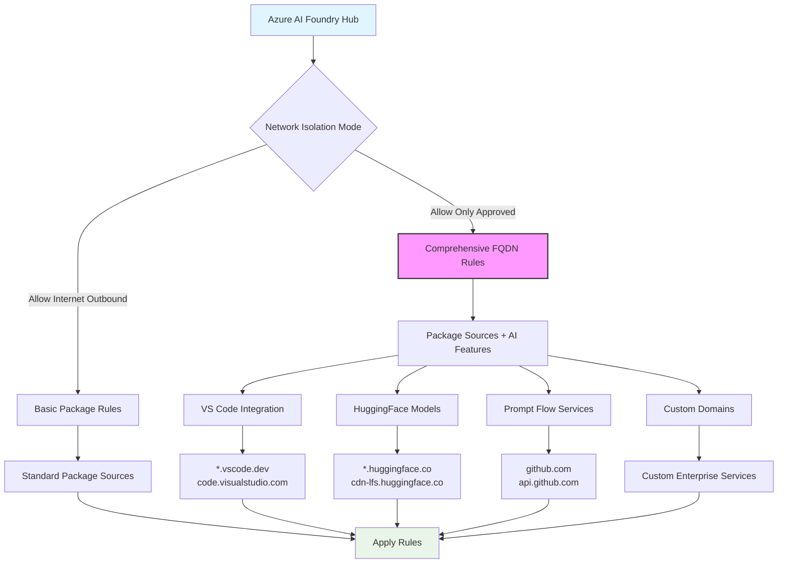

# Azure AI Foundry & Machine Learning Package Allowlist Tool

**Version 0.5.0 (Prerelease)**

A comprehensive tool to help **Azure AI Foundry** and Azure Machine Learning customers identify and configure allowed inbound/outbound URLs for Python packages in secured environments.

## Overview

When using **Azure AI Foundry Hubs** or **Azure Machine Learning workspaces** with network restrictions (`allow_only_approved_outbound` or customer-managed virtual networks), customers need to explicitly allow package download URLs. This tool automatically discovers package download domains and generates the necessary Azure CLI commands to configure your workspace or hub.

### ✨ **What's New in v0.5.0: Enhanced Azure AI Foundry Support**

- 🔮 **Azure AI Foundry Hub**: Optimized configuration for AI Foundry hubs
- 🔧 **VS Code Integration**: Enable browser-based development environments with `--include-vscode`
- 🤗 **HuggingFace Model Hub**: Direct access to model repositories with `--include-huggingface`
- 🌊 **Prompt Flow Services**: Advanced AI workflow orchestration with `--include-prompt-flow`
- ⚙️ **Custom Domain Support**: Flexible integration with `--custom-fqdns` for enterprise needs
- 🏗️ **Improved Architecture**: Enhanced discovery and mapping for both AI Foundry and Azure ML environments

## 🚨 DISCLAIMER

**This tool is provided "AS IS" without warranty of any kind. You use this tool and implement its recommendations at your own risk. Always review and test configurations in a non-production environment first.**

## Features

### Core Package Management
- ✅ Supports multiple package managers (pip, conda, uv, poetry)
- ✅ Works with both managed virtual networks and customer-managed VNets
- ✅ Handles both isolation modes (`allow_internet_outbound` and `allow_only_approved_outbound`)
- ✅ Discovers transitive dependencies
- ✅ Generates Azure CLI commands for easy implementation
- ✅ Detects private/internal repositories with guidance
- ✅ Provides platform-specific considerations (Windows/Linux)
- ✅ Docker support for isolated execution

### Azure AI Foundry Enhancements
- 🔮 **Hub Type Selection**: Choose between `azure-ml` and `ai-foundry` configurations
- 🔧 **VS Code Integration**: Enable browser-based VS Code with `--include-vscode`
- 🤗 **HuggingFace Access**: Direct model hub integration with `--include-huggingface`
- 🌊 **Prompt Flow Support**: AI workflow orchestration with `--include-prompt-flow`
- ⚙️ **Custom FQDNs**: Flexible integration with `--custom-fqdns`
- 📊 **Mermaid Diagrams**: Visual network configuration guides

## Quick Start

### Prerequisites

1. **Python 3.12+**
2. **Azure CLI** with ML extension
3. **Docker** (optional, for containerized execution)

### Installation Options

#### Option 1: Using Conda/Miniconda
```bash
conda create -n azureml-package-tool python=3.12
conda activate azureml-package-tool
pip install -r requirements.txt
```

#### Option 2: Using pip with venv
```bash
python3.12 -m venv azureml-package-tool
source azureml-package-tool/bin/activate  # On Windows: azureml-package-tool\Scripts\activate
pip install -r requirements.txt
```

#### Option 3: Using uv
```bash
uv venv azureml-package-tool --python 3.12
source azureml-package-tool/bin/activate  # On Windows: azureml-package-tool\Scripts\activate
uv pip install -r requirements.txt
```

#### Option 4: Docker
```bash
docker build -t azureml-package-tool .
docker run -it -v $(pwd):/workspace azureml-package-tool
```

### Azure CLI Setup

```bash
# Install Azure CLI (if not already installed)
curl -sL https://aka.ms/InstallAzureCLIDeb | sudo bash

# Install ML extension
az extension add -n ml

# Login to Azure
az login

# Set your subscription
az account set --subscription "your-subscription-id"
```

## Usage

### Azure AI Foundry Hub (Recommended for New Projects)

```bash
# Basic AI Foundry hub configuration with enhanced AI features
python main.py \
  --hub-type ai-foundry \
  --workspace-name "your-ai-foundry-hub" \
  --resource-group "your-rg" \
  --requirements-file "requirements.txt" \
  --include-vscode \
  --include-huggingface
```

### Azure Machine Learning Workspace (Fully Supported)

```bash
# Azure ML workspace - complete backward compatibility maintained
python main.py \
  --hub-type azure-ml \
  --workspace-name "your-ml-workspace" \
  --resource-group "your-rg" \
  --requirements-file "requirements.txt"
```

### Advanced AI Foundry Configuration

```bash
# Full-featured AI Foundry hub setup
python main.py \
  --hub-type ai-foundry \
  --workspace-name "production-ai-hub" \
  --resource-group "your-rg" \
  --subscription-id "your-sub-id" \
  --requirements-file "requirements.txt" \
  --conda-env "environment.yml" \
  --include-vscode \
  --include-huggingface \
  --include-prompt-flow \
  --custom-fqdns "internal-models.company.com,api.corp.com" \
  --output-format cli \
  --output-file "ai-foundry-rules.sh"
```

### Input File Formats Supported

- **requirements.txt** (pip)
- **environment.yml** (conda)
- **pyproject.toml** (poetry, uv)
- **Pipfile** (pipenv)

### Example Output

```bash
#!/bin/bash
# Azure AI Foundry Hub Outbound Rules Configuration
# Hub Type: ai-foundry
# Workspace/Hub: your-ai-foundry-hub

# Package repositories
az ml workspace outbound-rule create \
  --workspace-name "$WORKSPACE_NAME" \
  --resource-group "$RESOURCE_GROUP" \
  --rule-name "pypi-packages" \
  --type fqdn \
  --destination "*.pypi.org"

# VS Code integration
az ml workspace outbound-rule create \
  --workspace-name "$WORKSPACE_NAME" \
  --resource-group "$RESOURCE_GROUP" \
  --rule-name "vscode-web" \
  --type fqdn \
  --destination "*.vscode.dev"

# HuggingFace model access
az ml workspace outbound-rule create \
  --workspace-name "$WORKSPACE_NAME" \
  --resource-group "$RESOURCE_GROUP" \
  --rule-name "huggingface-models" \
  --type fqdn \
  --destination "*.huggingface.co"
```

## How It Works

The tool follows a systematic approach to analyze your environment and generate the appropriate network rules:

### Complete Workflow


### Tool Architecture

The tool uses a modular architecture designed for both Azure AI Foundry and Azure ML environments:


### Azure AI Foundry Enhanced Workflow



## Documentation

- 🔮 [Azure AI Foundry Network Configuration Guide](docs/ai-foundry-networking.md) **← Start Here**
- 🤖 [Azure ML Network Configuration Guide](docs/azure-ml-networking.md)
- 🔒 [Private Repository Handling](docs/private-repositories.md)
- 📋 [Package Discovery Methods](docs/package-discovery.md)
- 🔧 [Troubleshooting Guide](docs/troubleshooting.md)

## Platform Considerations

### Windows vs Linux Packages
Some packages have platform-specific dependencies. The tool will detect and warn about potential cross-platform issues.

### Private/Internal Repositories
When private repositories are detected, the tool provides guidance on:
- Uploading packages to Azure Storage
- Configuring blob storage access
- Setting up private endpoints

## Contributing

This tool is designed to be community-driven. Please contribute improvements, bug fixes, and additional package manager support.

## Support

This is a community tool. For Azure ML specific issues, refer to [Microsoft's official documentation](https://learn.microsoft.com/en-us/azure/machine-learning/).

## License

MIT License - see LICENSE file for details. 