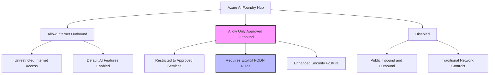
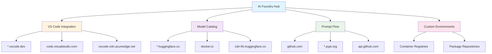
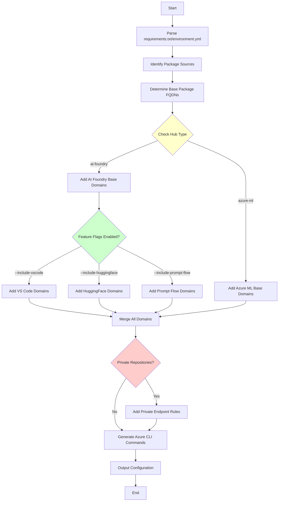
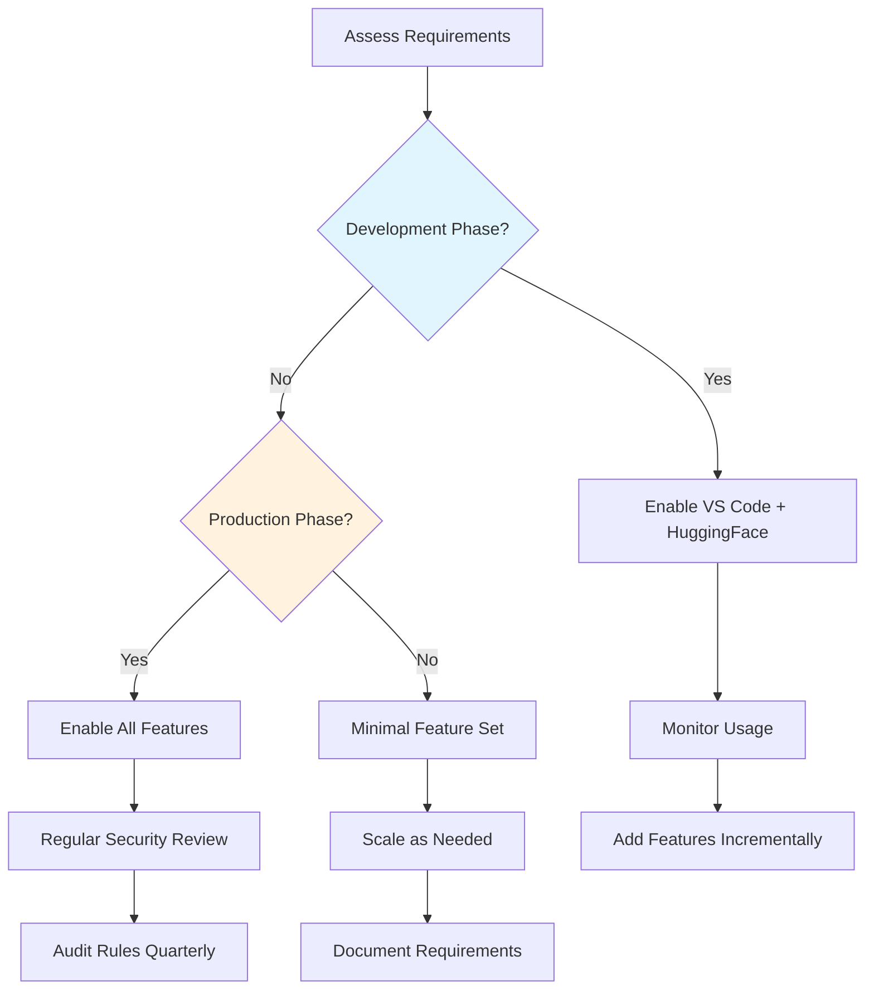

# Azure AI Foundry Hub Network Configuration Guide

This guide focuses on configuring network security for Azure AI Foundry Hubs, providing enhanced guidance for AI-specific features and integrations.

## Table of Contents

- [Overview](#overview)
- [Network Isolation Modes](#network-isolation-modes)
- [Azure AI Foundry Features](#azure-ai-foundry-features)
- [Configuration Examples](#configuration-examples)
- [Feature-Specific Requirements](#feature-specific-requirements)
- [Usage Examples](#usage-examples)
- [Best Practices](#best-practices)
- [Troubleshooting](#troubleshooting)

## Overview

Azure AI Foundry Hubs extend Azure Machine Learning capabilities with enhanced AI features, including integrated development environments, model catalogs, and prompt engineering tools. When configured with network restrictions, these features require additional FQDN rules beyond standard package management.

### Key Differences from Azure ML

- **Enhanced Development Environment**: VS Code integration for browser-based development
- **Model Catalog Integration**: Direct access to HuggingFace and other model repositories
- **Prompt Flow**: Advanced orchestration capabilities for AI workflows
- **Extended AI Services**: Integration with Azure AI services and third-party providers

## Network Isolation Modes

Azure AI Foundry Hubs support the same isolation modes as Azure ML workspaces:



### Isolation Mode Details

1. **Allow Internet Outbound** (Default)
   - Most AI features work without additional configuration
   - Outbound rules needed only for private resources
   - Suitable for development and testing

2. **Allow Only Approved Outbound** (Recommended for Production)
   - All internet access blocked by default
   - Requires explicit FQDN rules for each service
   - Maximum security with granular control
   - **⚠️ Azure Firewall costs apply for FQDN rules**

3. **Disabled**
   - Uses customer-managed virtual network
   - Network rules configured through NSGs, Firewall, UDRs
   - Full customer control over network policies

## Azure AI Foundry Features

Azure AI Foundry includes several features that require specific network access:

### Core Features and Their Requirements

| Feature | Purpose | Network Requirements |
|---------|---------|---------------------|
| **VS Code Integration** | Browser-based development environment | `*.vscode.dev`, `code.visualstudio.com` |
| **Model Catalog** | Access to HuggingFace and model repositories | `*.huggingface.co`, `docker.io` |
| **Prompt Flow** | AI workflow orchestration | `github.com`, package repositories |
| **Custom Environments** | Docker image management | Container registry access |

### Feature Dependencies Flow



## Configuration Examples

### Basic AI Foundry Configuration

```bash
# Azure AI Foundry Hub with essential features
python main.py \
  --hub-type ai-foundry \
  --workspace-name "my-ai-foundry-hub" \
  --resource-group "my-rg" \
  --requirements-file "requirements.txt" \
  --include-vscode \
  --include-huggingface \
  --output-format cli
```

### Complete Feature Set

```bash
# Enable all AI Foundry features
python main.py \
  --hub-type ai-foundry \
  --workspace-name "production-ai-hub" \
  --resource-group "prod-rg" \
  --requirements-file "requirements.txt" \
  --conda-env "environment.yml" \
  --include-vscode \
  --include-huggingface \
  --include-prompt-flow \
  --custom-fqdns "custom-model-repo.company.com,internal-api.corp.com" \
  --output-format cli \
  --output-file "ai-foundry-rules.sh"
```

### Rule Generation Process



## Feature-Specific Requirements

### Visual Studio Code Integration

Enables browser-based VS Code for development directly in Azure AI Foundry.

**Required FQDNs:**
```bash
# VS Code core services
*.vscode.dev                      # VS Code web interface
code.visualstudio.com            # Authentication and licensing
vscode-cdn.azureedge.net         # CDN for VS Code assets
vscode.blob.core.windows.net     # Extension storage
vsmarketplacebadge.apphb.com     # Extension marketplace badges
```

**CLI Command:**
```bash
python main.py --hub-type ai-foundry --include-vscode [other options]
```

### HuggingFace Model Access

Provides access to HuggingFace model hub and datasets.

**Required FQDNs:**
```bash
# HuggingFace services
huggingface.co                   # Main HuggingFace site
*.huggingface.co                # Subdomains (models, datasets, etc.)
cdn-lfs.huggingface.co          # Large file storage CDN
datasets-server.huggingface.co   # Dataset processing services

# Docker/Container access (for containerized models)
docker.io                        # Docker Hub main
*.docker.com                     # Docker CDN and services
registry-1.docker.io            # Docker registry
production.cloudflare.docker.com # Docker CDN
```

**CLI Command:**
```bash
python main.py --hub-type ai-foundry --include-huggingface [other options]
```

### Prompt Flow Services

Enables advanced AI workflow orchestration capabilities.

**Required FQDNs:**
```bash
# GitHub access (for flow templates and samples)
github.com                       # Main GitHub site
*.github.com                     # GitHub CDN and services
api.github.com                   # GitHub API
raw.githubusercontent.com        # Raw file access
objects.githubusercontent.com    # Git LFS objects

# Package repositories (overlaps with standard packages)
*.pypi.org                       # Python packages
*.pythonhosted.org              # Python package hosting
```

**CLI Command:**
```bash
python main.py --hub-type ai-foundry --include-prompt-flow [other options]
```

## Usage Examples

### Example 1: Development Environment Setup

```bash
# Set up AI Foundry hub for data science team
python main.py \
  --hub-type ai-foundry \
  --workspace-name "datascience-dev-hub" \
  --resource-group "datascience-rg" \
  --requirements-file "requirements.txt" \
  --include-vscode \
  --include-huggingface \
  --verbose
```

**Generated Output:**
```bash
#!/bin/bash
# Azure AI Foundry Hub Outbound Rules Configuration
# Hub Type: ai-foundry
# Workspace/Hub: datascience-dev-hub

# Package repositories
az ml workspace outbound-rule create \
  --workspace-name "$WORKSPACE_NAME" \
  --resource-group "$RESOURCE_GROUP" \
  --rule-name "pypi-packages" \
  --type fqdn \
  --destination "*.pypi.org"

# VS Code integration
az ml workspace outbound-rule create \
  --workspace-name "$WORKSPACE_NAME" \
  --resource-group "$RESOURCE_GROUP" \
  --rule-name "vscode-web" \
  --type fqdn \
  --destination "*.vscode.dev"

# HuggingFace model access
az ml workspace outbound-rule create \
  --workspace-name "$WORKSPACE_NAME" \
  --resource-group "$RESOURCE_GROUP" \
  --rule-name "huggingface-models" \
  --type fqdn \
  --destination "*.huggingface.co"
```

### Example 2: Production Environment

```bash
# Production AI Foundry hub with all features
python main.py \
  --hub-type ai-foundry \
  --workspace-name "prod-ai-foundry" \
  --resource-group "production-rg" \
  --subscription-id "12345678-1234-1234-1234-123456789abc" \
  --requirements-file "requirements.txt" \
  --conda-env "environment.yml" \
  --include-vscode \
  --include-huggingface \
  --include-prompt-flow \
  --custom-fqdns "internal-models.company.com" \
  --output-format json \
  --output-file "prod-ai-config.json"
```

### Example 3: Custom Model Repository Integration

```bash
# AI Foundry with private model repository
python main.py \
  --hub-type ai-foundry \
  --workspace-name "custom-ai-hub" \
  --resource-group "ai-rg" \
  --requirements-file "requirements.txt" \
  --custom-fqdns "models.company.com,ml-api.internal.com" \
  --include-huggingface \
  --output-format yaml
```

## Best Practices

### 1. Feature Selection Strategy



### 2. Cost Optimization

**Azure Firewall FQDN Rule Costs:**
- Each FQDN rule incurs charges in Azure Firewall
- Consolidate similar domains where possible
- Use wildcards appropriately (balance security vs. cost)
- Monitor usage and remove unused rules

**Example Cost-Optimized Configuration:**
```bash
# Use broader wildcards where security permits
--custom-fqdns "*.company.com"  # Instead of individual subdomains
```

### 3. Security Considerations

- **Principle of Least Privilege**: Only enable features actually needed
- **Regular Audits**: Review enabled features and their usage quarterly
- **Monitor Access Patterns**: Use Azure Monitor to track outbound connections
- **Staged Deployment**: Test new features in development before production

### 4. Feature Management

```bash
# Start minimal and add features as needed
python main.py --hub-type ai-foundry --requirements-file req.txt

# Add VS Code when developers need browser-based editing
python main.py --hub-type ai-foundry --include-vscode --requirements-file req.txt

# Add HuggingFace when AI models are required
python main.py --hub-type ai-foundry --include-vscode --include-huggingface --requirements-file req.txt
```

## Troubleshooting

### Common Issues

1. **VS Code Integration Not Working**
   ```bash
   # Check if VS Code domains are accessible
   curl -I https://vscode.dev
   nslookup code.visualstudio.com
   
   # Verify outbound rules
   az ml workspace outbound-rule list --workspace-name "hub-name" --resource-group "rg"
   ```

2. **HuggingFace Model Download Failures**
   ```bash
   # Test HuggingFace connectivity
   curl -I https://huggingface.co
   curl -I https://cdn-lfs.huggingface.co
   
   # Check for missing Docker access (for containerized models)
   curl -I https://docker.io
   ```

3. **Prompt Flow Template Access Issues**
   ```bash
   # Test GitHub connectivity
   curl -I https://github.com
   curl -I https://api.github.com
   
   # Check for authentication issues
   git ls-remote https://github.com/microsoft/promptflow.git
   ```

### Diagnostic Commands

```bash
# Comprehensive connectivity test
python main.py \
  --hub-type ai-foundry \
  --workspace-name "test-hub" \
  --resource-group "test-rg" \
  --requirements-file "requirements.txt" \
  --include-vscode \
  --include-huggingface \
  --include-prompt-flow \
  --dry-run \
  --verbose
```

### Network Monitoring

```bash
# Monitor outbound connections from compute instances
# From Azure AI Foundry compute instance terminal:

# Test package repositories
pip install -vv numpy  # Shows download URLs

# Test VS Code connectivity
curl -v https://vscode.dev

# Test HuggingFace access
python -c "from transformers import pipeline; print('HuggingFace accessible')"
```

## Additional Resources

- [Azure AI Foundry Documentation](https://learn.microsoft.com/en-us/azure/ai-services/ai-foundry/)
- [Managed Network Configuration](https://learn.microsoft.com/en-us/azure/machine-learning/how-to-managed-network)
- [Azure Firewall FQDN Rules](https://learn.microsoft.com/en-us/azure/firewall/fqdn-tags)
- [Private Repository Handling Guide](private-repositories.md)
- [Azure ML Networking Guide](azure-ml-networking.md)

---

## 🚨 Important Notes

- **Preview Features**: Some AI Foundry features may be in preview and require additional domains
- **Cost Awareness**: Each FQDN rule in Azure Firewall incurs costs
- **Security Review**: Regularly audit enabled features and their network requirements
- **Testing**: Always test configurations in non-production environments first
- **Community Feedback**: Report issues and suggestions to improve this tool

---

**Disclaimer**: This guide is provided "AS IS" without warranty. Test all configurations thoroughly before applying to production environments. 