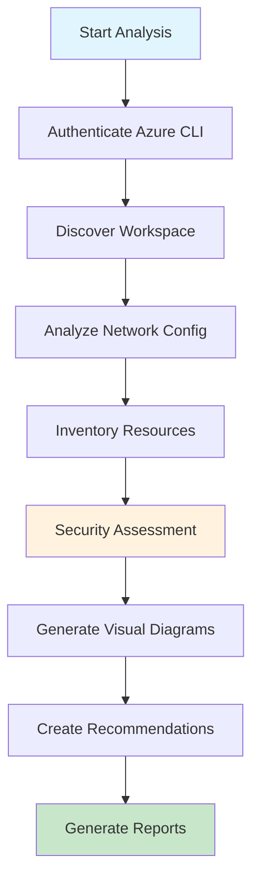
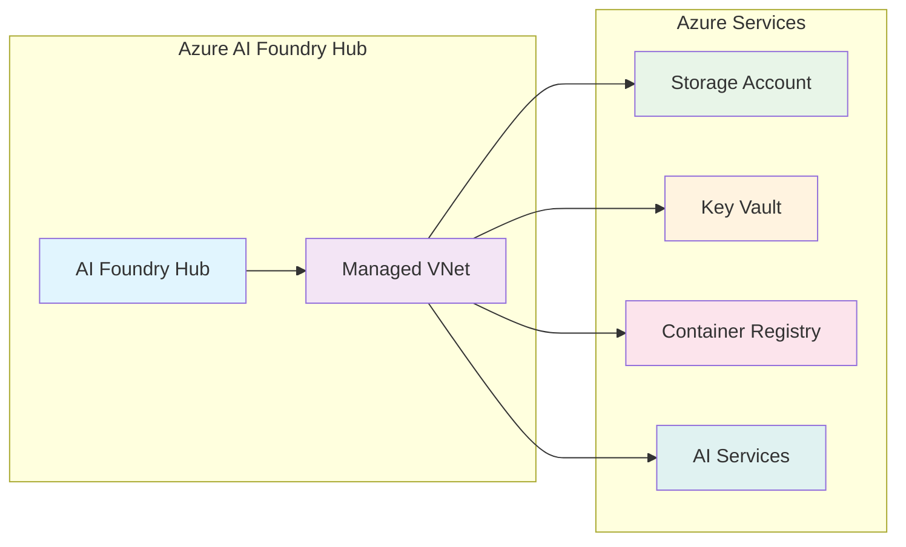
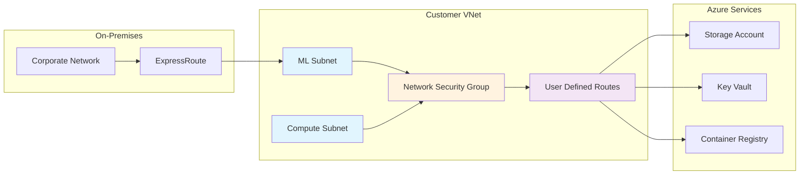
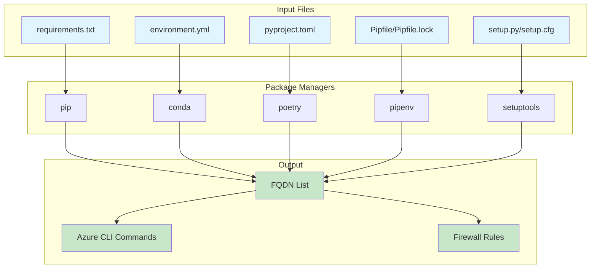
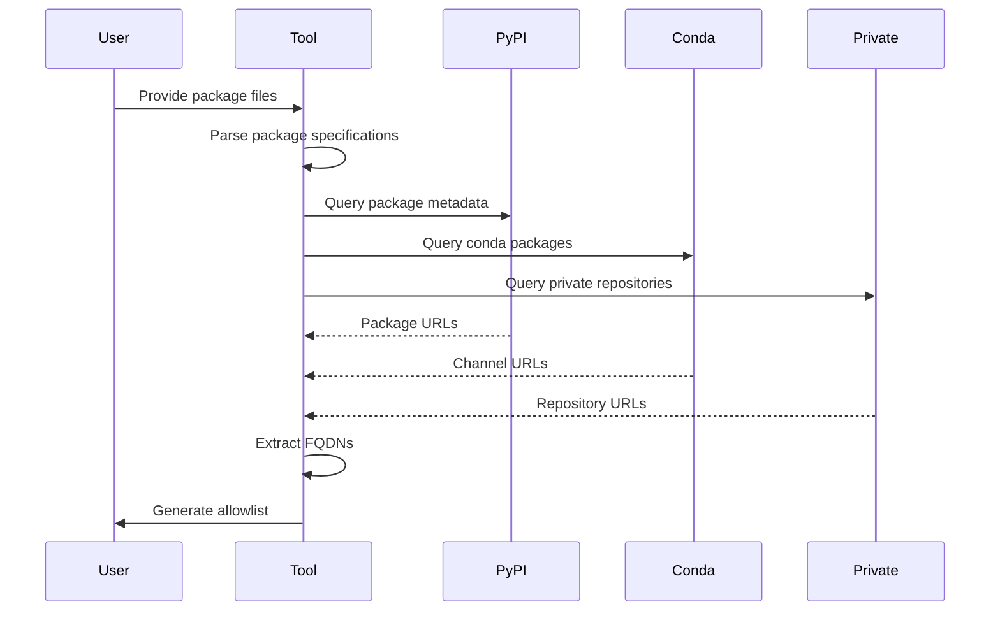
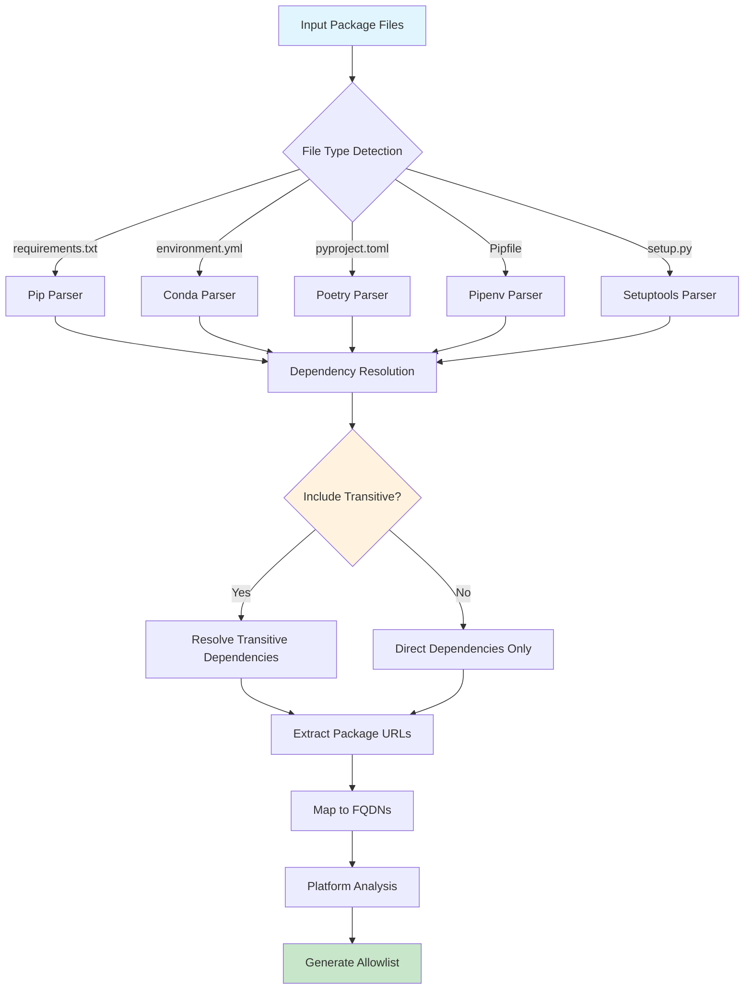
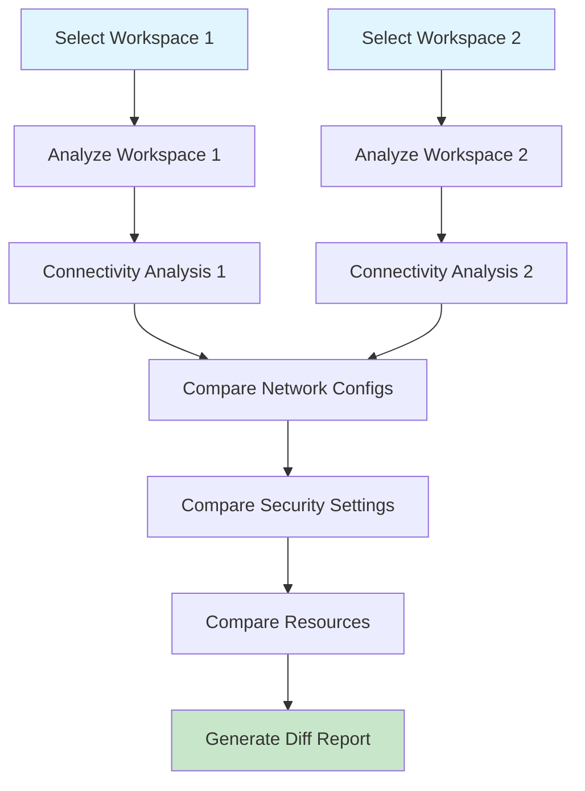
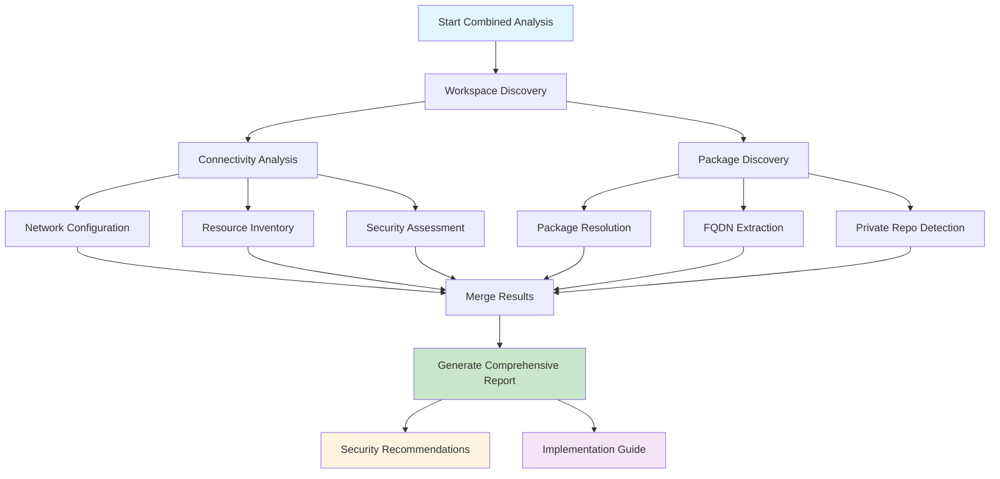

# Analysis & Discovery Guide

> **⚠️ DISCLAIMER**: This analysis and discovery guide is provided "AS IS" without warranty of any kind, express or implied. Users implement these configurations at their own risk and should thoroughly test all configurations in non-production environments before deployment.

This comprehensive guide covers both connectivity analysis and package discovery capabilities of the Azure AI Foundry & Machine Learning Package Tool.

## 🎯 Overview

The tool provides two main analysis capabilities:

1. **🔍 Connectivity Analysis** - Network configuration, security assessment, and resource discovery
2. **📦 Package Discovery** - Python package dependency analysis and FQDN generation

Both can be run independently or together for comprehensive workspace analysis.

## 🔍 Connectivity Analysis

### What It Analyzes

Connectivity analysis examines your Azure AI Foundry hub or Azure ML workspace to provide:

- **Network Configuration**: VNet setup, isolation modes, private endpoints
- **Security Posture**: Security scores, compliance status, risk assessment  
- **Resource Inventory**: All connected Azure resources with security evaluation
- **Visual Diagrams**: Network relationships using Mermaid charts
- **Actionable Recommendations**: Specific steps to improve security

### Analysis Flow



### Network Configuration Types

#### 1. Managed Virtual Network

**Azure-managed network infrastructure:**



**Characteristics:**
- Automatic subnet and IP management
- Built-in security configurations
- Simplified outbound rule management
- Two isolation modes: "Allow Internet Outbound" vs "Allow Only Approved Outbound"

#### 2. Customer-Managed Virtual Network

**User-controlled network infrastructure:**



**Characteristics:**
- Full control over network configuration
- Custom routing and security rules
- Integration with on-premises networks
- Manual private endpoint management

### Security Assessment

The tool calculates security scores based on multiple factors:

| Factor | Weight | Good Practice |
|--------|--------|---------------|
| **Private Endpoints** | 30% | All critical resources use private endpoints |
| **Public Access** | 25% | Public network access disabled |
| **Network Isolation** | 20% | "Allow Only Approved Outbound" mode |
| **Resource Configuration** | 15% | Secure defaults for storage, key vault, etc. |
| **Compliance** | 10% | Meets organizational security standards |

#### Security Score Interpretation

- **🟢 80-100**: Excellent security posture
- **🟡 60-79**: Good with room for improvement  
- **🟠 40-59**: Moderate security concerns
- **🔴 0-39**: Significant security issues requiring attention

### Sample Connectivity Report

```markdown
# Azure AI Foundry Connectivity Analysis

## 📋 Executive Summary

**Workspace:** production-ai-hub  
**Type:** Azure AI Foundry Hub  
**Location:** East US  
**Analysis Date:** 2024-06-28 15:30:25

### Security Overview
- **Overall Score:** 85/100 🟢
- **Network Type:** Managed Virtual Network
- **Isolation Mode:** Allow Only Approved Outbound
- **Public Access:** ✅ Disabled

## 🔗 Connected Resources

| Resource | Type | Access Method | Security Status |
|----------|------|---------------|-----------------|
| prodstorageaccount | Storage Account | Private Endpoint | ✅ Secure |
| prodkeyvault | Key Vault | Private Endpoint | ✅ Secure |
| prodregistry | Container Registry | Public Access | ⚠️ Review Needed |

## 🛡️ Recommendations

1. **High Priority**: Enable private endpoint for Container Registry
2. **Medium Priority**: Review outbound rules for completeness
3. **Low Priority**: Consider enabling diagnostic logging
```

## 📦 Package Discovery

### What It Discovers

Package discovery analyzes your Python dependencies to generate network allowlists:

- **Package Sources**: PyPI, Conda, private repositories
- **Direct Dependencies**: Packages explicitly listed in your files
- **Transitive Dependencies**: Indirect dependencies of your packages
- **Download URLs**: All FQDNs needed for package installation
- **Platform Variations**: OS-specific package requirements

### Supported Package File Formats



### Package Resolution Process



### AI Foundry Enhanced Features

When analyzing Azure AI Foundry hubs, additional package sources are included:

#### VS Code Server Integration
```
*.vscode-cdn.net
marketplace.visualstudio.com
*.vo.msecnd.net
code.visualstudio.com
```

#### HuggingFace Model Access
```
huggingface.co
*.huggingface.co
cdn-lfs.huggingface.co
datasets-server.huggingface.co
```

#### Prompt Flow Dependencies
```
api.github.com
github.com
raw.githubusercontent.com
```

### Package Discovery Flow



### Example Package Analysis Output

```bash
# Required FQDNs for Package Installation

## Python Package Index
pypi.org
*.pythonhosted.org
files.pythonhosted.org

## GitHub Repositories  
github.com
api.github.com
codeload.github.com
raw.githubusercontent.com

## Conda Repositories
anaconda.org
*.anaconda.org
conda.anaconda.org
repo.anaconda.com

## AI Foundry Enhanced (if enabled)
*.vscode-cdn.net
marketplace.visualstudio.com
huggingface.co
*.huggingface.co
```

## 🔄 Workspace Comparison Analysis

Compare two workspaces to identify configuration differences:

### Comparison Process



### Sample Comparison Report

```markdown
# Workspace Comparison: Production vs Development

## Configuration Differences

| Setting | Production | Development | Status |
|---------|------------|-------------|--------|
| **Network Isolation** | Allow Only Approved | Allow Internet | ⚠️ Different |
| **Public Access** | Disabled | Enabled | ⚠️ Different |
| **Private Endpoints** | 4/4 enabled | 2/4 enabled | ⚠️ Different |

## Security Score Comparison
- **Production**: 85/100 🟢
- **Development**: 65/100 🟡
- **Gap**: 20 points

## Recommendations
1. Align development environment with production security settings
2. Enable missing private endpoints in development
3. Consider separate security policies for dev/prod
```

## 🎯 Combined Analysis

Running both connectivity analysis and package discovery together provides the most comprehensive view:

### Benefits of Combined Analysis

1. **Complete FQDN Coverage**: Network requirements + package requirements
2. **Holistic Security View**: Infrastructure security + dependency security
3. **Actionable Recommendations**: Both network and package management guidance
4. **Compliance Reporting**: Complete documentation for security reviews

### Combined Analysis Flow



## 🛠️ Implementation Examples

### Azure Firewall Application Rules

```json
{
  "applicationRuleCollections": [
    {
      "name": "AzureMLPackages",
      "priority": 100,
      "action": "Allow",
      "rules": [
        {
          "name": "PythonPackages",
          "protocols": [
            {"port": 443, "protocolType": "Https"}
          ],
          "targetFqdns": [
            "pypi.org",
            "*.pythonhosted.org", 
            "github.com",
            "api.github.com"
          ],
          "sourceAddresses": ["10.0.0.0/8"]
        }
      ]
    }
  ]
}
```

### Network Security Group Rules

```json
{
  "securityRules": [
    {
      "name": "AllowPyPIOutbound",
      "properties": {
        "protocol": "TCP",
        "sourcePortRange": "*",
        "destinationPortRange": "443",
        "sourceAddressPrefix": "VirtualNetwork",
        "destinationAddressPrefix": "*.pypi.org",
        "access": "Allow",
        "priority": 1000,
        "direction": "Outbound"
      }
    }
  ]
}
```

## 🚨 Troubleshooting

### Common Analysis Issues

1. **Authentication Failures**
   ```bash
   # Ensure Azure CLI is configured
   az login
   az account set --subscription "your-subscription-id"
   ```

2. **Permission Errors**
   ```bash
   # Required roles:
   # - Reader on workspace and resources
   # - Contributor for network modifications
   ```

3. **Package Resolution Failures**
   ```bash
   # Test package file syntax
   pip install --dry-run -r requirements.txt
   ```

4. **Network Timeout Issues**
   ```bash
   # Check network connectivity
   curl -I https://pypi.org
   curl -I https://api.github.com
   ```

### Performance Optimization

- **Use caching**: Results are cached for repeated analyses
- **Parallel processing**: Multiple workspaces analyzed concurrently
- **Incremental updates**: Only analyze changed components
- **Resource filtering**: Focus on specific resource types

## 📊 Best Practices

### For Connectivity Analysis

1. **Regular Monitoring**: Schedule monthly connectivity reviews
2. **Security Baselines**: Establish security score targets  
3. **Change Tracking**: Monitor configuration drift over time
4. **Compliance**: Use reports for security audits

### For Package Discovery

1. **Version Pinning**: Use exact package versions in production
2. **Dependency Auditing**: Regular security scans of dependencies
3. **Private Repository Strategy**: Clear policies for internal packages
4. **Platform Consistency**: Ensure cross-platform compatibility

### For Combined Analysis

1. **Holistic Reviews**: Analyze both network and package security together
2. **Environment Parity**: Compare dev/staging/prod configurations
3. **Documentation**: Maintain current network diagrams and package inventories
4. **Automation**: Integrate analysis into CI/CD pipelines

---

> **Note**: This analysis framework provides comprehensive visibility into your Azure AI/ML environment security posture. Always validate recommendations in non-production environments before implementing changes. 