# Connectivity Analysis Guide

## Overview

The connectivity analysis feature provides comprehensive insights into the network configuration and security posture of your Azure AI Foundry Hubs and Azure Machine Learning Workspaces.

## Prerequisites

- Azure CLI installed with ML extension
- Appropriate RBAC permissions (Reader or higher)
- Access to the target workspace/hub

## Usage

### Basic Analysis

```bash
python main.py \
  --hub-type azure-ai-foundry \
  --workspace-name my-workspace \
  --resource-group my-rg \
  --action analyze-connectivity
```

### Advanced Options

```bash
# Specify subscription
python main.py \
  --hub-type azure-ml \
  --workspace-name my-workspace \
  --resource-group my-rg \
  --subscription my-subscription-id \
  --action analyze-connectivity \
  --verbose

# Use environment variables
export AZURE_SUBSCRIPTION_ID="your-subscription-id"
python main.py \
  --hub-type azure-ai-foundry \
  --workspace-name $WORKSPACE_NAME \
  --resource-group $RESOURCE_GROUP \
  --action analyze-connectivity
```

## Understanding the Report

### Executive Summary
Provides a high-level overview including:
- Workspace details
- Network configuration type
- Security status
- Key metrics

### Network Configuration
Details about:
- Network isolation mode
- Private endpoints
- Outbound rules
- Public access settings

### Connected Resources
Comprehensive list of all connected Azure resources:
- Default resources (Storage, Key Vault, ACR)
- Compute resources
- Custom connections
- Security assessment for each resource

### Security Analysis
- Overall security score
- Identified vulnerabilities
- Compliance status
- Risk assessment

### Connectivity Diagram
Visual representation using Mermaid diagrams showing:
- Resource relationships
- Network paths
- Security boundaries

### Recommendations
Actionable guidance including:
- Security improvements
- Best practices
- Configuration optimizations

## Interpreting Results

### Security Scores

| Score | Level | Description |
|-------|-------|-------------|
| 80-100 | High | Well-secured with private endpoints and no public access |
| 60-79 | Medium | Some security measures in place but improvements needed |
| 0-59 | Low | Significant security concerns requiring immediate attention |

### Network Types

1. **Managed Virtual Network**
   - Microsoft-managed network infrastructure
   - Simplified security management
   - Automatic private endpoint creation

2. **Customer Virtual Network**
   - Customer-managed VNet
   - Full control over network configuration
   - Manual private endpoint management

### Common Findings

#### ⚠️ Public Network Access Enabled
**Risk**: Resources accessible from the internet
**Recommendation**: Disable public access and use private endpoints

#### ⚠️ Missing Private Endpoints
**Risk**: Traffic traversing public internet
**Recommendation**: Configure private endpoints for all critical resources

#### ✅ Strict Outbound Control
**Status**: Good security practice
**Note**: Only approved destinations allowed

## Troubleshooting

### Permission Errors
```
Error: Failed to get workspace info: AuthorizationFailed
```
**Solution**: Ensure you have Reader access to the workspace and resources

### Network Timeout
```
Error: Network analysis failed: Request timeout
```
**Solution**: Check your network connectivity and Azure CLI configuration

### Missing Resources
```
Warning: Failed to analyze storage account
```
**Solution**: Verify the resource exists and you have access permissions

## Best Practices

1. **Run Regular Analyses**
   - Schedule weekly or monthly checks
   - Compare reports over time
   - Track security improvements

2. **Act on Recommendations**
   - Prioritize high-risk findings
   - Implement changes gradually
   - Verify improvements with re-analysis

3. **Share Reports**
   - Distribute to security teams
   - Include in compliance documentation
   - Use for audit purposes

## API Integration

For programmatic access:

```python
from src.connectivity.connectivity_analyzer import ConnectivityAnalyzer

analyzer = ConnectivityAnalyzer(
    workspace_name="my-workspace",
    resource_group="my-rg",
    subscription_id="my-subscription",
    hub_type="azure-ai-foundry"
)

result = analyzer.analyze()
if result.success:
    print(f"Analysis complete: {result.data}")
```

## Report Examples

### Sample Markdown Report Structure

```markdown
# Azure AI Foundry Connectivity Analysis Report

## 📋 Executive Summary

**Workspace:** my-ai-foundry-hub  
**Type:** Azure AI Foundry  
**Location:** East US  
**Analysis Date:** 2024-12-03 14:30:25

### Key Findings

- **Network Type:** Managed
- **Isolation Mode:** Allow Only Approved Outbound
- **Public Network Access:** ✅ Disabled
- **Total Connected Resources:** 8
- **Average Security Score:** 85/100

### Quick Status

🛡️ **Private Network** | 🔒 **3 Private Endpoints** | ✅ **High Security**

## Network Configuration

**Configuration Type:** managed

### Managed Virtual Network Details

- **Isolation Mode:** allow_only_approved_outbound
- **Public Network Access:** False

#### Network Isolation Settings

| Setting | Value |
|---------|-------|
| Allow Internet Outbound | False |
| Allow Only Approved Outbound | True |
| Disabled | False |

## Connected Resources Overview

| Resource Type | Count | Avg Security Score |
|---------------|-------|-------------------|
| storage_accounts | 2 | 90.0/100 |
| key_vaults | 1 | 95.0/100 |
| container_registries | 1 | 85.0/100 |
| cognitive_services | 4 | 78.8/100 |

## Network Connectivity Diagram

```mermaid
graph TB
    subgraph "Azure Subscription"
        subgraph "Resource Group"
            Hub["my-ai-foundry-hub<br/>(AI Foundry Hub)"]
            ManagedVNet["Managed VNet<br/>(Microsoft-managed)"]
            Hub --> ManagedVNet
            storage0["primary-storage<br/>(storage_accounts)<br/>🔒 Private Endpoint"]
            keyvault0["hub-keyvault<br/>(key_vaults)<br/>🔒 Private Endpoint"]
            Hub --> storage0
            Hub --> keyvault0
        end
    end
```


```

This comprehensive guide provides all the information needed to effectively use the connectivity analysis feature and interpret its results.

## Related Documentation

- [Architecture Documentation](connectivity-architecture.md)
- [Migration Guide](migration-guide.md)
- [Troubleshooting Guide](../troubleshooting.md#connectivity-analysis-issues) 