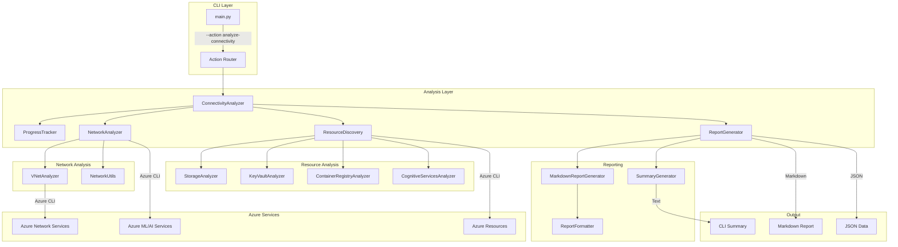
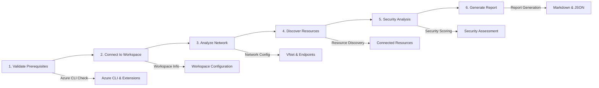
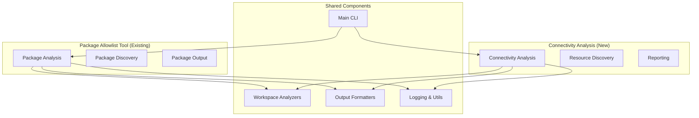

# Connectivity Analysis Architecture

## Overview

The connectivity analysis feature is built using a modular architecture that extends the existing Azure AI/ML Package Allowlist tool.

## Architecture Diagram



## Component Descriptions

### Core Components

1. **ConnectivityAnalyzer** (`connectivity_analyzer.py`)
   - Main orchestrator for the analysis
   - Coordinates all analysis phases
   - Manages progress tracking
   - Generates final results

2. **NetworkAnalyzer** (`network_analyzer.py`)
   - Analyzes network configuration
   - Detects managed vs customer VNet
   - Discovers private endpoints
   - Analyzes outbound rules

3. **ResourceDiscovery** (`resource_discovery.py`)
   - Discovers connected Azure resources
   - Analyzes resource security settings
   - Builds dependency graph
   - Calculates security scores

4. **ReportGenerator** (`report_generator.py`)
   - Creates comprehensive reports
   - Generates Mermaid diagrams
   - Formats analysis results
   - Supports multiple output formats

### Supporting Components

1. **ProgressTracker** (`progress_tracker.py`)
   - Provides real-time progress updates
   - Tracks analysis steps
   - Records timing information
   - Handles step failures gracefully

2. **VNetAnalyzer** (`vnet_analyzer.py`)
   - Analyzes virtual network configurations
   - Discovers NSG rules
   - Maps subnet configurations
   - Identifies route tables

3. **Resource Analyzers** (`resource_analyzers.py`)
   - Specialized analyzers for each resource type
   - Deep security analysis
   - Configuration assessment
   - Best practice validation

## Data Flow

1. **Initialization**
   ```
   CLI → ConnectivityAnalyzer → Validate Prerequisites
   ```

2. **Workspace Connection**
   ```
   ConnectivityAnalyzer → WorkspaceAnalyzer → Azure ML/AI Service
   ```

3. **Network Analysis**
   ```
   NetworkAnalyzer → Azure CLI → Network Configuration → Results
   ```

4. **Resource Discovery**
   ```
   ResourceDiscovery → Azure CLI → Connected Resources → Analysis
   ```

5. **Report Generation**
   ```
   Analysis Results → ReportGenerator → Markdown/JSON Output
   ```

## Analysis Steps

The connectivity analysis follows a systematic 6-step process:



## Extension Points

### Adding New Resource Types

1. Create analyzer in `resource_analyzers.py`:
   ```python
   class NewResourceAnalyzer:
       @staticmethod
       def analyze_detailed(resource_name: str, ...) -> Dict:
           # Implementation
   ```

2. Register in `resource_discovery.py`:
   ```python
   analyzers = {
       'Microsoft.NewService/resources': self._analyze_new_resource,
       # ...
   }
   ```

### Adding New Report Formats

1. Create new generator extending `BaseReportGenerator`
2. Implement `generate()` and `save()` methods
3. Add format option to CLI

### Custom Security Scoring

Override `get_security_score()` in `ConnectedResource` class:
```python
def get_security_score(self) -> int:
    # Custom scoring logic
    return score
```

## Performance Considerations

1. **Parallel Processing**
   - Resource analysis can be parallelized
   - Network calls are async where possible
   - Caching for repeated analyses

2. **Timeout Handling**
   - Each step has configurable timeout
   - Graceful degradation on failures
   - Partial results on timeout

3. **Memory Management**
   - Streaming for large datasets
   - Efficient JSON handling
   - Resource cleanup after analysis

## Security Considerations

1. **Authentication**
   - Uses Azure CLI authentication
   - No credentials stored
   - RBAC permissions enforced

2. **Data Handling**
   - Sensitive data masked in reports
   - No data transmitted externally
   - Local report storage only

3. **Access Control**
   - Read-only operations
   - No modifications to resources
   - Audit trail via Azure logs

## Integration Architecture



## Class Hierarchy

### Analyzer Classes
```python
BaseAnalyzer (abstract)
├── ConnectivityAnalyzer
├── NetworkAnalyzer
├── VNetAnalyzer
└── ResourceDiscovery
    ├── StorageAnalyzer
    ├── KeyVaultAnalyzer
    ├── ContainerRegistryAnalyzer
    └── CognitiveServicesAnalyzer
```

### Report Generator Classes
```python
BaseReportGenerator (abstract)
├── MarkdownReportGenerator
└── SummaryReportGenerator
```

### Data Classes
```python
AnalysisResult
ConnectedResource
ReportSection
NetworkConfiguration
SecuritySummary
```

## File Organization

```
src/connectivity/
├── __init__.py                 # Package initialization
├── base_analyzer.py           # Base classes and interfaces
├── connectivity_analyzer.py   # Main analysis orchestrator
├── network_analyzer.py        # Network configuration analysis
├── vnet_analyzer.py           # VNet-specific analysis
├── resource_discovery.py      # Resource discovery and analysis
├── resource_analyzers.py      # Resource-specific analyzers
├── network_utils.py           # Network utility functions
├── progress_tracker.py        # Progress tracking and reporting
├── report_generator.py        # Report generation framework
├── report_formatter.py        # Formatting utilities
└── summary_generator.py       # CLI summary generation
```

## Error Handling Strategy

1. **Graceful Degradation**
   - Continue analysis even if some steps fail
   - Provide partial results
   - Clear error reporting

2. **Retry Logic**
   - Automatic retry for transient failures
   - Exponential backoff
   - Timeout controls

3. **User Communication**
   - Progress indicators
   - Helpful error messages
   - Troubleshooting guidance

## Future Enhancements

### Planned Features
- HTML report generation
- Interactive dashboards
- Automated remediation suggestions
- Integration with Azure Security Center
- Real-time monitoring capabilities

### Extension Opportunities
- Custom plugins for specialized analysis
- Third-party security tool integration
- Automated compliance checking
- Performance benchmarking

This architecture provides a solid foundation for comprehensive connectivity analysis while maintaining flexibility for future enhancements and integrations. 