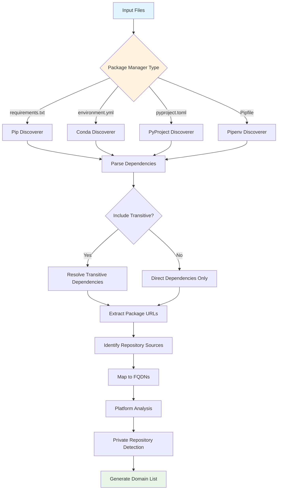
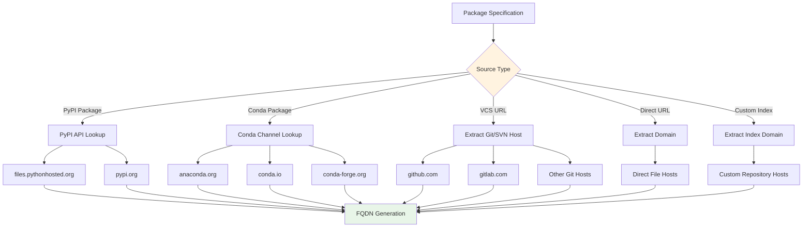
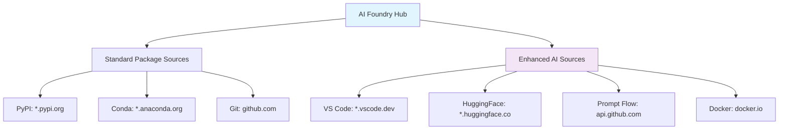
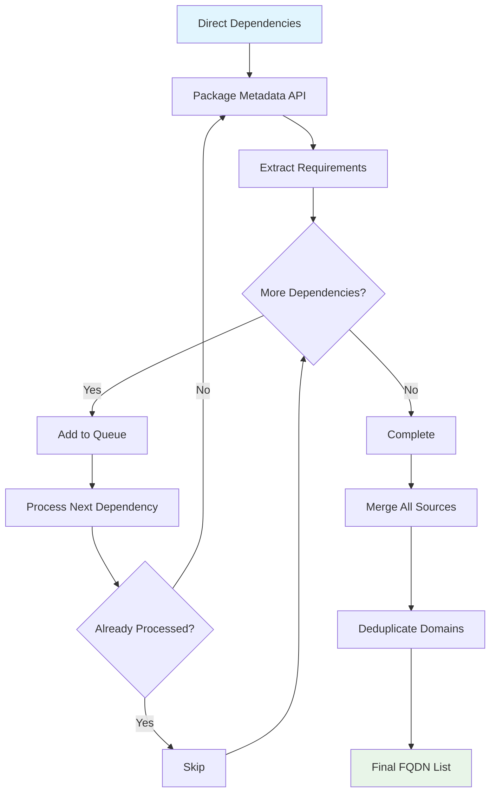
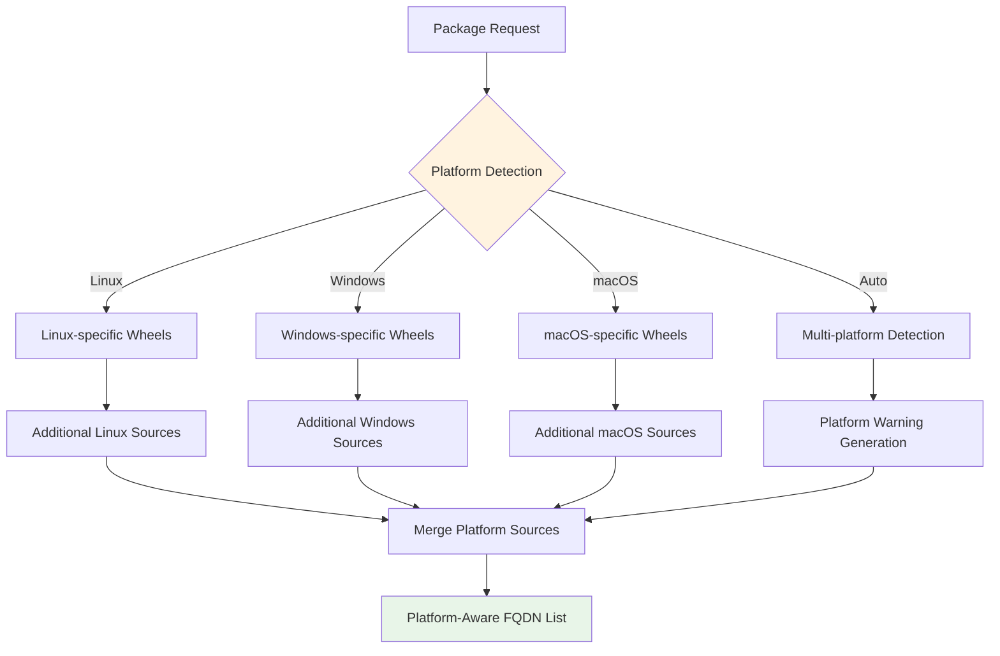
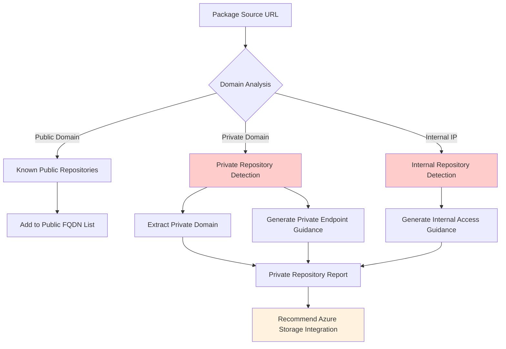

# Package Discovery Methods

> **⚠️ DISCLAIMER**: This documentation is provided "AS IS" without warranty of any kind, express or implied. Users implement these recommendations at their own risk and should thoroughly test all configurations in non-production environments before deployment.

This guide explains how the Azure AI Foundry & Machine Learning Package Tool discovers and analyzes package dependencies to generate network allowlist rules.

## Table of Contents

- [Overview](#overview)
- [Supported Package Managers](#supported-package-managers)
- [Discovery Process](#discovery-process)
- [Package Source Analysis](#package-source-analysis)
- [Transitive Dependency Handling](#transitive-dependency-handling)
- [Platform-Specific Considerations](#platform-specific-considerations)
- [Private Repository Detection](#private-repository-detection)

## Overview

The package discovery system analyzes various package manager files to extract dependency information and map them to their respective download sources. This enables automatic generation of Azure outbound rules for secured environments.

### Discovery Flow



## Supported Package Managers

### 1. Pip (requirements.txt)

**Primary use case**: Python package management for Azure AI Foundry Hubs and Azure ML

**Supported formats**:
```txt
# Direct package names
numpy==1.21.0
pandas>=1.3.0
scikit-learn

# VCS dependencies
git+https://github.com/user/repo.git@v1.0#egg=package

# Direct URLs
https://files.pythonhosted.org/packages/.../package.whl

# Index URLs
--index-url https://pypi.org/simple/
--extra-index-url https://custom.pypi.org/simple/
```

**Discovery method**: 
- Parses requirement specifiers
- Resolves package metadata from PyPI API
- Maps to `*.pypi.org`, `*.pythonhosted.org`

### 2. Conda (environment.yml)

**Primary use case**: Cross-language package management, popular in data science workflows

**Supported formats**:
```yaml
name: my-env
channels:
  - conda-forge
  - defaults
dependencies:
  - python=3.9
  - numpy
  - pip
  - pip:
    - tensorflow
```

**Discovery method**:
- Extracts conda channels
- Maps to `*.anaconda.org`, `*.conda.io`
- Processes embedded pip dependencies

### 3. Poetry (pyproject.toml)

**Primary use case**: Modern Python dependency management with lock files

**Supported formats**:
```toml
[tool.poetry.dependencies]
python = "^3.9"
numpy = "^1.21.0"

[[tool.poetry.source]]
name = "custom"
url = "https://custom.pypi.org/simple/"
```

**Discovery method**:
- Parses TOML dependency specifications
- Extracts custom PyPI sources
- Maps to configured repositories

### 4. Pipenv (Pipfile)

**Primary use case**: Virtual environment and dependency management

**Supported formats**:
```toml
[[source]]
url = "https://pypi.org/simple"
verify_ssl = true
name = "pypi"

[packages]
numpy = "*"
requests = "==2.25.1"
```

**Discovery method**:
- Extracts source URLs
- Processes package specifications
- Maps to configured sources

## Package Source Analysis

### Repository Mapping Process



### Azure AI Foundry Enhanced Sources

When `--hub-type ai-foundry` is specified, additional sources are considered:



## Transitive Dependency Handling

### Resolution Strategy

The tool supports two modes for dependency resolution:

1. **Direct Dependencies Only** (`--include-transitive=false`)
   - Faster execution
   - May miss indirect package sources
   - Suitable for well-known, stable environments

2. **Full Transitive Resolution** (`--include-transitive=true`, default)
   - Complete dependency tree analysis
   - Discovers all potential sources
   - Recommended for production environments

### Transitive Resolution Flow



## Platform-Specific Considerations

### Cross-Platform Package Differences

Some packages have platform-specific variants that may require different sources:



### Platform Warnings

The tool generates warnings for potential cross-platform issues:

- **Binary wheel availability**
- **Platform-specific dependencies**
- **Architecture-specific packages** (ARM vs x86_64)

## Private Repository Detection

### Detection Methods



### Private Repository Handling

When private repositories are detected:

1. **Generate Warnings**: Alert about potential access issues
2. **Provide Guidance**: Suggest Azure Storage alternatives
3. **Create Rules**: Generate private endpoint configurations
4. **Document Requirements**: List additional security considerations

### Example Private Repository Output

```bash
⚠️  PRIVATE REPOSITORIES DETECTED:
- https://internal-pypi.company.com/simple/
- git+https://private-git.corp.com/ml-models.git

💡 RECOMMENDATIONS:
1. Upload packages to Azure Storage Account
2. Configure private endpoints for blob storage access
3. Update package URLs to use Azure Storage
4. Test accessibility from compute instances
```

## Best Practices

### For Azure AI Foundry Hubs

1. **Enable Transitive Resolution**: Always use `--include-transitive=true`
2. **Include AI Features**: Use `--include-vscode`, `--include-huggingface` as needed
3. **Platform Awareness**: Specify target platform explicitly
4. **Test Discovery**: Use `--dry-run` to validate before applying rules

### For Azure ML Workspaces

1. **Backward Compatibility**: Tool maintains full Azure ML support
2. **Selective Features**: Only include needed integrations
3. **Existing Support**: Continues to work with existing configurations
4. **Integration Path**: Easy integration with existing workflows

## Troubleshooting Discovery Issues

### Common Issues

1. **Missing Dependencies**: Enable transitive resolution
2. **Private Repository Errors**: Check authentication and network access
3. **Platform Mismatches**: Specify correct target platform
4. **API Rate Limits**: Use caching and retry mechanisms

### Debug Commands

```bash
# Verbose discovery with dry-run
python main.py --verbose --dry-run [other options]

# Test specific package manager
python main.py --requirements-file only.txt --verbose

# Platform-specific discovery
python main.py --platform linux --verbose [other options]
```

---

> **⚠️ REMINDER**: This tool is provided "AS IS" without warranty. Always validate generated configurations in non-production environments before applying to production systems. The discovery process relies on external APIs and services which may change without notice. 