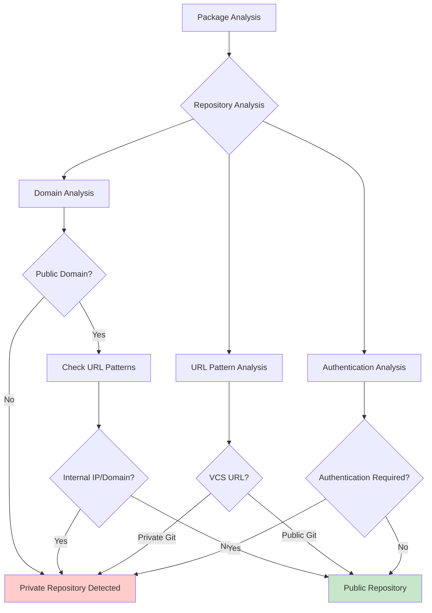
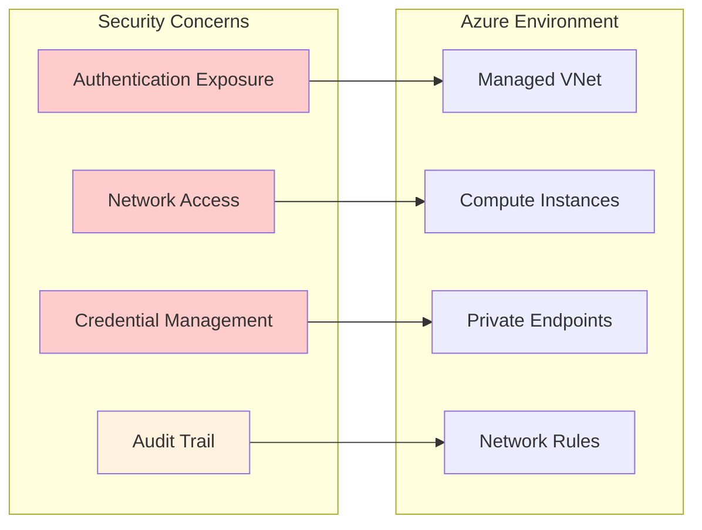
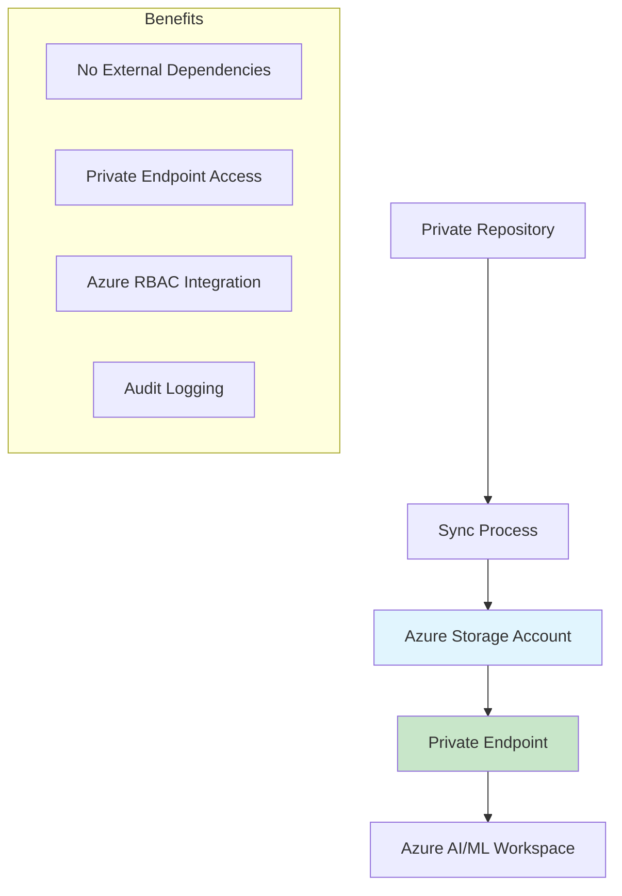
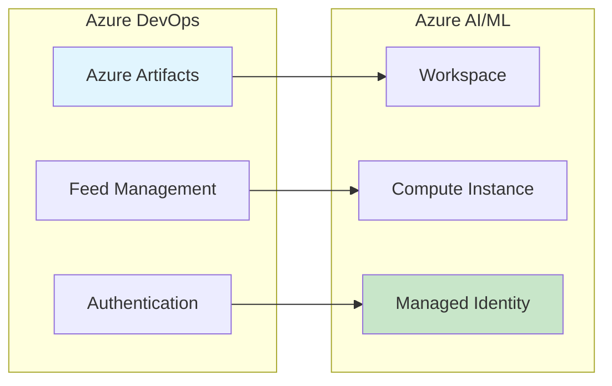
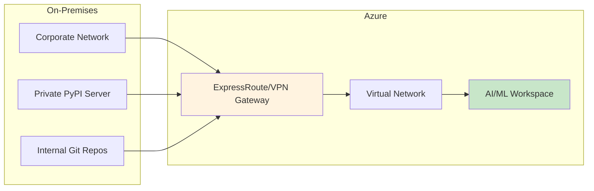
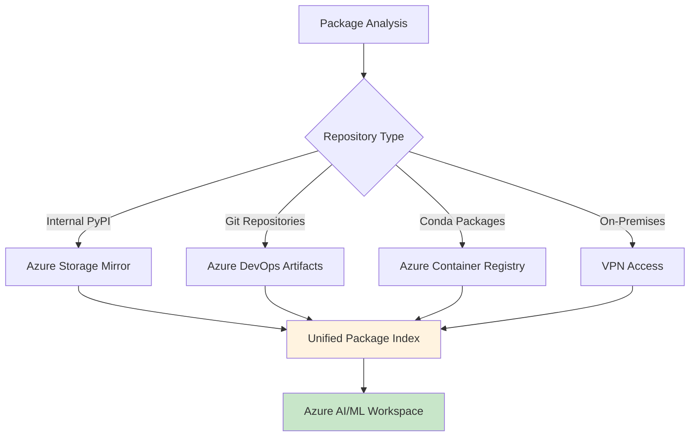
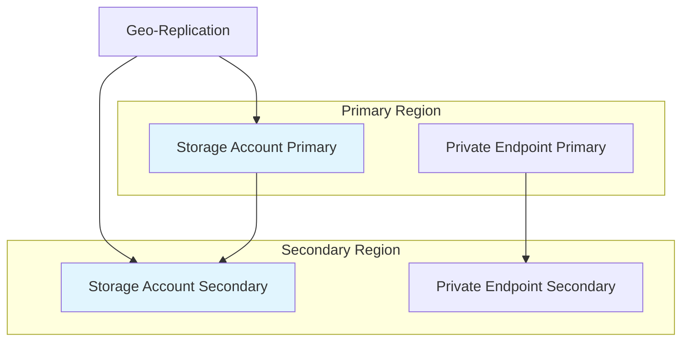
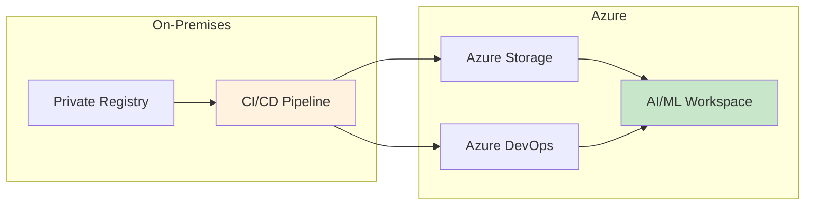

# Private Package Repositories Guide

> **⚠️ DISCLAIMER**: This private repositories guide is provided "AS IS" without warranty of any kind, express or implied. Users implement these configurations at their own risk and should thoroughly test all private repository configurations in non-production environments before deployment.

This comprehensive guide covers detection, analysis, and configuration strategies for private package repositories in Azure AI Foundry and Azure Machine Learning environments.

## 🎯 Overview

Private package repositories are essential for enterprise environments but require special handling in secured Azure networks. This guide covers:

- **Detection**: Automatically identify private repositories in your dependencies
- **Analysis**: Understand access patterns and security implications
- **Solutions**: Multiple strategies for accessing private packages in Azure
- **Implementation**: Step-by-step configuration guides
- **Best Practices**: Security and operational recommendations

## 🔍 Private Repository Detection

The tool automatically detects private repositories through multiple indicators:

### Detection Methods



### Common Private Repository Patterns

#### Git Repositories
```bash
# Private GitHub
git+https://github.com/company/private-repo.git

# Azure DevOps
git+https://dev.azure.com/organization/project/_git/repository

# GitLab
git+https://gitlab.company.com/team/project.git

# Bitbucket
git+https://bitbucket.org/company/private-repo.git
```

#### Private PyPI Indexes
```bash
# Corporate PyPI server
--index-url https://pypi.company.com/simple/
--extra-index-url https://pypi.internal.corp/simple/

# JFrog Artifactory
--index-url https://company.jfrog.io/company/api/pypi/pypi-local/simple/

# Azure Artifacts
--index-url https://pkgs.dev.azure.com/organization/_packaging/feed/pypi/simple/
```

#### Private Conda Channels
```yaml
channels:
  - https://conda.company.com/channel
  - https://artifacts.company.com/conda
```

## 🛡️ Security Implications

### Risks of Private Repositories in Azure



### Common Security Issues

1. **Credential Exposure**: Authentication tokens in configuration files
2. **Network Access**: Private repositories may not be accessible from Azure VNets
3. **SSL/TLS Issues**: Self-signed certificates or internal CAs
4. **Audit Requirements**: Need to track access to proprietary packages
5. **Compliance**: Data sovereignty and access control requirements

## 🔧 Solution Strategies

### Strategy 1: Azure Storage Account Mirror

**Best for**: Complete control and Azure-native solution



#### Implementation Steps

1. **Create Azure Storage Account**:
   ```bash
   az storage account create \
     --name mycompanypypi \
     --resource-group my-rg \
     --location eastus \
     --sku Standard_LRS \
     --kind StorageV2
   ```

2. **Configure Private Endpoint**:
   ```bash
   az network private-endpoint create \
     --name mycompanypypi-pe \
     --resource-group my-rg \
     --vnet-name my-vnet \
     --subnet my-subnet \
     --private-connection-resource-id /subscriptions/.../storageAccounts/mycompanypypi \
     --connection-name mycompanypypi-connection \
     --group-id blob
   ```

3. **Sync Packages**:
   ```python
   # sync-packages.py
   import os
   from azure.storage.blob import BlobServiceClient
   
   def sync_private_packages():
       # Download from private repository
       # Upload to Azure Storage
       # Maintain package index structure
   ```

4. **Configure Package Installation**:
   ```bash
   pip install --index-url https://mycompanypypi.blob.core.windows.net/pypi/simple/ package-name
   ```

### Strategy 2: Azure DevOps Artifacts

**Best for**: Organizations already using Azure DevOps



#### Implementation Steps

1. **Create Azure Artifacts Feed**:
   ```bash
   az artifacts universal publish \
     --organization https://dev.azure.com/myorg \
     --project myproject \
     --scope project \
     --feed myfeed \
     --name mypackage \
     --version 1.0.0 \
     --path ./packages
   ```

2. **Configure Authentication**:
   ```bash
   # Using personal access token
   pip install --index-url https://pkgs.dev.azure.com/myorg/_packaging/myfeed/pypi/simple/ \
     --extra-index-url https://pypi.org/simple/ \
     mypackage
   ```

3. **Managed Identity Integration**:
   ```python
   from azure.identity import DefaultAzureCredential
   from azure.devops import connection
   
   # Authenticate using managed identity
   credentials = DefaultAzureCredential()
   ```

### Strategy 3: VPN/ExpressRoute Access

**Best for**: Existing on-premises infrastructure



#### Configuration Requirements

1. **Network Routing**:
   ```bash
   # Configure user-defined routes
   az network route-table route create \
     --name to-onprem-pypi \
     --route-table-name my-route-table \
     --resource-group my-rg \
     --address-prefix 10.0.100.0/24 \
     --next-hop-type VirtualNetworkGateway
   ```

2. **DNS Configuration**:
   ```bash
   # Private DNS zone for internal domains
   az network private-dns zone create \
     --resource-group my-rg \
     --name company.com
   ```

### Strategy 4: Hybrid Approach

**Best for**: Complex environments with multiple private sources



## 📋 Implementation Guide

### Phase 1: Assessment

```bash
# Run tool to identify private repositories
python main.py \
  --workspace-name my-workspace \
  --resource-group my-rg \
  --requirements-file requirements.txt \
  --verbose
```

**Expected Output**:
```
⚠️  PRIVATE REPOSITORIES DETECTED:
- https://pypi.company.com/simple/
- git+https://github.com/company/private-ml-lib.git
- https://artifacts.company.com/conda/main

💡 RECOMMENDATIONS:
1. Migrate to Azure Storage Account for PyPI packages
2. Use Azure DevOps Artifacts for Git repositories  
3. Configure private endpoints for secure access
```

### Phase 2: Repository Migration

#### For PyPI Packages

1. **Create Storage Account Structure**:
   ```
   container: pypi
   ├── simple/
   │   ├── package1/
   │   │   └── index.html
   │   └── package2/
   │       └── index.html
   └── packages/
       ├── package1-1.0.0.tar.gz
       └── package2-2.0.0-py3-none-any.whl
   ```

2. **Sync Script Example**:
   ```python
   import requests
   from azure.storage.blob import BlobServiceClient
   
   def sync_pypi_packages(source_index, storage_account):
       # Download package metadata from private PyPI
       # Upload to Azure Storage maintaining structure
       # Generate simple repository index
   ```

#### For Git Repositories

1. **Mirror to Azure DevOps**:
   ```bash
   # Create new repository
   az repos create --name private-ml-lib --organization myorg --project myproject
   
   # Mirror repository
   git clone --mirror https://github.com/company/private-ml-lib.git
   cd private-ml-lib.git
   git remote set-url --push origin https://dev.azure.com/myorg/myproject/_git/private-ml-lib
   git push --mirror
   ```

### Phase 3: Network Configuration

#### Azure Firewall Rules

```json
{
  "applicationRuleCollections": [
    {
      "name": "PrivateRepositories",
      "rules": [
        {
          "name": "AzureStoragePyPI",
          "protocols": [{"port": 443, "protocolType": "Https"}],
          "targetFqdns": ["*.blob.core.windows.net"],
          "sourceAddresses": ["10.0.0.0/8"]
        },
        {
          "name": "AzureDevOpsArtifacts", 
          "protocols": [{"port": 443, "protocolType": "Https"}],
          "targetFqdns": ["*.dev.azure.com", "*.visualstudio.com"],
          "sourceAddresses": ["10.0.0.0/8"]
        }
      ]
    }
  ]
}
```

#### Private Endpoints

```bash
# Storage Account Private Endpoint
az network private-endpoint create \
  --name storage-pypi-pe \
  --resource-group my-rg \
  --vnet-name my-vnet \
  --subnet pe-subnet \
  --private-connection-resource-id /subscriptions/.../storageAccounts/mycompanypypi \
  --group-id blob \
  --connection-name storage-pypi-connection

# Private DNS Zone
az network private-dns zone create \
  --resource-group my-rg \
  --name privatelink.blob.core.windows.net
```

### Phase 4: Workspace Configuration

#### Update Package Files

**Before** (with private repositories):
```txt
# requirements.txt
--index-url https://pypi.company.com/simple/
--extra-index-url https://pypi.org/simple/

numpy==1.21.0
company-ml-package==2.0.0
git+https://github.com/company/private-lib.git@v1.0.0
```

**After** (with Azure solutions):
```txt
# requirements.txt
--index-url https://mycompanypypi.blob.core.windows.net/pypi/simple/
--extra-index-url https://pypi.org/simple/

numpy==1.21.0
company-ml-package==2.0.0
git+https://dev.azure.com/myorg/myproject/_git/private-lib@v1.0.0
```

#### Authentication Configuration

```python
# For Azure Storage Account
from azure.identity import DefaultAzureCredential
from azure.storage.blob import BlobServiceClient

credential = DefaultAzureCredential()
blob_client = BlobServiceClient(
    account_url="https://mycompanypypi.blob.core.windows.net",
    credential=credential
)

# For Azure DevOps Artifacts
import subprocess
import os

# Using managed identity token
token = subprocess.check_output([
    'az', 'account', 'get-access-token', 
    '--resource', 'https://pkgs.dev.azure.com/',
    '--query', 'accessToken', '-o', 'tsv'
]).decode().strip()

os.environ['AZURE_DEVOPS_EXT_PAT'] = token
```

## 🔐 Security Best Practices

### Authentication & Authorization

1. **Use Managed Identities**: Avoid storing credentials in code or configuration
2. **Principle of Least Privilege**: Grant minimal required permissions
3. **Regular Token Rotation**: Implement automated credential rotation
4. **Audit Access**: Enable logging for all repository access

### Network Security

1. **Private Endpoints**: Use private endpoints for all Azure services
2. **Network Segmentation**: Isolate package repository traffic
3. **SSL/TLS**: Ensure all connections use modern encryption
4. **Certificate Management**: Use Azure Key Vault for certificate storage

### Operational Security

1. **Package Scanning**: Implement security scanning for private packages
2. **Vulnerability Management**: Regular updates and patch management  
3. **Backup Strategy**: Ensure repository availability and disaster recovery
4. **Change Management**: Track all changes to package repositories

## 📊 Monitoring & Troubleshooting

### Monitoring Private Repository Access

```bash
# Azure Storage Account metrics
az monitor metrics list \
  --resource /subscriptions/.../storageAccounts/mycompanypypi \
  --metric BlobRequests \
  --interval PT1H

# Azure DevOps usage analytics
az devops project show --organization myorg --project myproject
```

### Common Issues & Solutions

#### Authentication Failures

```bash
# Check managed identity assignment
az role assignment list --assignee <managed-identity-principal-id>

# Verify token acquisition
az account get-access-token --resource https://storage.azure.com/
```

#### Network Connectivity Issues

```bash
# Test private endpoint connectivity
nslookup mycompanypypi.blob.core.windows.net

# Verify network rules
az storage account network-rule list --account-name mycompanypypi
```

#### Package Installation Failures

```bash
# Test package availability
curl -I https://mycompanypypi.blob.core.windows.net/pypi/simple/

# Debug pip installation
pip install --index-url https://mycompanypypi.blob.core.windows.net/pypi/simple/ \
  --verbose --debug package-name
```

## 🎯 Advanced Scenarios

### Multi-Region Setup



### Hybrid Cloud Integration



## 📝 Compliance Considerations

### Data Governance

- **Data Classification**: Classify package sensitivity levels
- **Access Controls**: Implement role-based access controls
- **Data Residency**: Ensure packages remain in required regions
- **Retention Policies**: Define package lifecycle management

### Audit Requirements

- **Access Logging**: Log all package download activities
- **Change Tracking**: Track package versions and modifications
- **Compliance Reporting**: Generate compliance reports for auditors
- **Incident Response**: Prepare for security incident procedures

---

> **Important**: Private repository configuration is critical for enterprise security. Always test configurations thoroughly in non-production environments and ensure compliance with organizational security policies before deploying to production systems. 