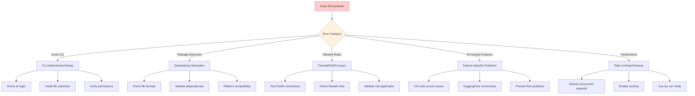
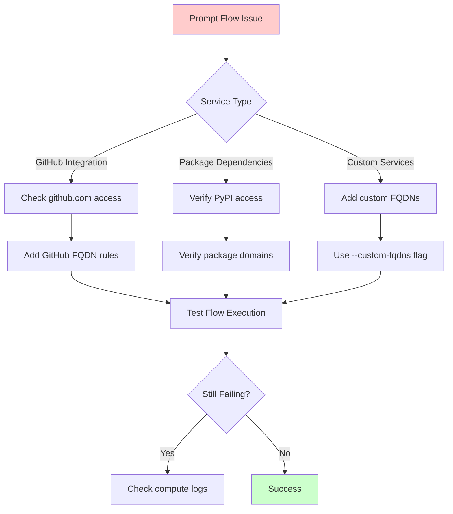

# Troubleshooting Guide

> **⚠️ DISCLAIMER**: This troubleshooting guide is provided "AS IS" without warranty of any kind, express or implied. Users implement these solutions at their own risk and should thoroughly test all fixes in non-production environments before applying to production systems.

This guide helps resolve common issues when using the Azure AI Foundry & Machine Learning Package Tool.

## Table of Contents

- [Quick Diagnostics](#quick-diagnostics)
- [Azure CLI Issues](#azure-cli-issues)
- [Package Discovery Problems](#package-discovery-problems)
- [Network Configuration Issues](#network-configuration-issues)
- [Azure AI Foundry Specific Issues](#azure-ai-foundry-specific-issues)
- [Azure ML Workspace Issues](#azure-ml-workspace-issues)
- [Docker Container Issues](#docker-container-issues)
- [Performance and Rate Limiting](#performance-and-rate-limiting)

## Quick Diagnostics

### Pre-flight Checklist

Run this diagnostic command to check your environment:

```bash
# Quick environment check
python main.py --dry-run --verbose \
  --hub-type ai-foundry \
  --workspace-name "test" \
  --resource-group "test" \
  --requirements-file "requirements.txt"
```

### Common Issues Flow



## Azure CLI Issues

### Issue: Azure CLI Not Found

**Symptoms:**
```
❌ Azure CLI validation failed. Please run 'az login' and install the ML extension.
```

**Solutions:**

1. **Install Azure CLI:**
   ```bash
   # macOS
   brew install azure-cli
   
   # Ubuntu/Debian
   curl -sL https://aka.ms/InstallAzureCLIDeb | sudo bash
   
   # Windows (PowerShell)
   Invoke-WebRequest -Uri https://aka.ms/installazurecliwindows -OutFile .\AzureCLI.msi; Start-Process msiexec.exe -Wait -ArgumentList '/I AzureCLI.msi /quiet'
   ```

2. **Install ML Extension:**
   ```bash
   az extension add -n ml
   ```

3. **Verify Installation:**
   ```bash
   az version
   az extension list | grep ml
   ```

### Issue: Authentication Problems

**Symptoms:**
```
ERROR: Please run 'az login' to setup account.
```

**Solutions:**

1. **Interactive Login:**
   ```bash
   az login
   ```

2. **Service Principal Login:**
   ```bash
   az login --service-principal \
     --username $AZURE_CLIENT_ID \
     --password $AZURE_CLIENT_SECRET \
     --tenant $AZURE_TENANT_ID
   ```

3. **Managed Identity (Azure VM):**
   ```bash
   az login --identity
   ```

4. **Verify Authentication:**
   ```bash
   az account show
   az account list --output table
   ```

### Issue: Permission Denied

**Symptoms:**
```
ERROR: The client 'user@company.com' with object id 'xxxx' does not have authorization to perform action
```

**Required Permissions:**
- **Azure AI Foundry**: `AzureML Data Scientist` role minimum
- **Azure ML**: `Machine Learning Workspace Contributor` role minimum
- **Network Rules**: `Network Contributor` role for FQDN rules

**Solution:**
```bash
# Check current role assignments
az role assignment list --assignee $(az account show --query user.name -o tsv) --all

# Request access from workspace administrator
```

## Package Discovery Problems

### Issue: Requirements File Not Found

**Symptoms:**
```
❌ No input files specified. Please provide at least one package file.
```

**Solutions:**

1. **Verify File Path:**
   ```bash
   ls -la requirements.txt
   python main.py --requirements-file ./input/requirements.txt [other options]
   ```

2. **Create Sample File:**
   ```bash
   # Create basic requirements.txt
   cat > requirements.txt << EOF
   numpy>=1.21.0
   pandas>=1.3.0
   scikit-learn>=1.0.0
   EOF
   ```

### Issue: Package Resolution Failures

**Symptoms:**
```
❌ Error processing requirements.txt: Package 'unknown-package' not found
```

**Debugging Steps:**

1. **Test Package Individually:**
   ```bash
   pip install unknown-package --dry-run
   ```

2. **Check Package Name:**
   ```bash
   # Search for correct package name
   pip search partial-name-here
   ```

3. **Use Dry Run Mode:**
   ```bash
   python main.py --dry-run --verbose [other options]
   ```

### Issue: Transitive Dependencies Timeout

**Symptoms:**
```
Timeout resolving transitive dependencies for package 'tensorflow'
```

**Solutions:**

1. **Disable Transitive Resolution:**
   ```bash
   python main.py --include-transitive=false [other options]
   ```

2. **Increase Timeout (modify source):**
   ```python
   # In src/package_discoverer.py
   DEPENDENCY_TIMEOUT = 300  # Increase from default
   ```

3. **Use Package Subsets:**
   ```bash
   # Split large requirements.txt into smaller files
   split -l 10 requirements.txt req_part_
   ```

## Network Configuration Issues

### Issue: FQDN Rules Not Applied

**Symptoms:**
```
Rules generated but package downloads still fail in workspace
```

**Verification Steps:**

1. **Check Rule Application:**
   ```bash
   az ml workspace outbound-rule list \
     --workspace-name your-workspace \
     --resource-group your-rg
   ```

2. **Test Network Connectivity:**
   ```bash
   # From compute instance terminal
   nslookup pypi.org
   curl -I https://pypi.org/simple/
   ```

3. **Verify Workspace Mode:**
   ```bash
   az ml workspace show \
     --name your-workspace \
     --resource-group your-rg \
     --query outboundRules
   ```

### Issue: Private Repository Access

**Symptoms:**
```
⚠️ PRIVATE REPOSITORIES DETECTED:
- https://internal-pypi.company.com/simple/
```

**Solutions:**

1. **Azure Storage Migration:**
   ```bash
   # Upload packages to Azure Storage
   az storage blob upload-batch \
     --destination packages \
     --source ./local-packages \
     --account-name your-storage
   ```

2. **Private Endpoint Configuration:**
   ```bash
   # Create private endpoint for storage account
   az network private-endpoint create \
     --name storage-endpoint \
     --resource-group your-rg \
     --vnet-name your-vnet \
     --subnet default \
     --private-connection-resource-id /subscriptions/.../storageAccounts/your-storage \
     --connection-name storage-connection \
     --group-ids blob
   ```

## Azure AI Foundry Specific Issues

### Issue: VS Code Integration Not Working

**Symptoms:**
```
VS Code web interface fails to load in AI Foundry Hub
```

**Solutions:**

1. **Verify Feature Flag:**
   ```bash
   python main.py --include-vscode [other options]
   ```

2. **Check Generated Rules:**
   ```bash
   # Look for VS Code domains in output
   grep -i vscode azure-cli-commands.sh
   ```

3. **Required FQDNs:**
   ```
   *.vscode.dev
   code.visualstudio.com
   vscode-cdn.azureedge.net
   ```

### Issue: HuggingFace Model Access Blocked

**Symptoms:**
```
Cannot download models from HuggingFace hub
```

**Solutions:**

1. **Enable HuggingFace Support:**
   ```bash
   python main.py --include-huggingface [other options]
   ```

2. **Manual Rule Addition:**
   ```bash
   az ml workspace outbound-rule create \
     --workspace-name your-hub \
     --resource-group your-rg \
     --rule-name "huggingface-models" \
     --type fqdn \
     --destination "*.huggingface.co"
   ```

### Issue: Prompt Flow Services Unavailable

**Symptoms:**
```
Prompt Flow runtime fails to start or access external services
```

**Troubleshooting Flow:**



**Solutions:**

1. **Enable Prompt Flow:**
   ```bash
   python main.py --include-prompt-flow [other options]
   ```

2. **Add Custom Services:**
   ```bash
   python main.py --custom-fqdns "api.openai.com,custom-service.com" [other options]
   ```

## Azure ML Workspace Issues

### Issue: Legacy Workspace Configuration

**Symptoms:**
```
Workspace created before managed VNet support
```

**Solutions:**

1. **Check Workspace Version:**
   ```bash
   az ml workspace show \
     --name your-workspace \
     --resource-group your-rg \
     --query "{name:name,creationTime:systemData.createdAt}"
   ```

2. **Use Customer-Managed VNet:**
   ```bash
   python main.py \
     --hub-type azure-ml \
     --workspace-name your-workspace \
     [other options]
   ```

3. **Migration Guidance:**
   ```bash
   # Consider creating new AI Foundry Hub
   az ml workspace create \
     --name new-ai-foundry-hub \
     --resource-group your-rg \
     --kind "hub"
   ```

## Docker Container Issues

### Issue: Container Build Failures

**Symptoms:**
```
ERROR: failed to solve: failed to compute cache key
```

**Solutions:**

1. **Clear Docker Cache:**
   ```bash
   docker system prune -a
   docker build --no-cache -t azure-ai-foundry-package-tool .
   ```

2. **Platform Compatibility:**
   ```bash
   # For ARM Macs
   docker build --platform linux/amd64 -t azure-ai-foundry-package-tool .
   ```

3. **Check Dockerfile:**
   ```dockerfile
   # Verify base image
   FROM python:3.12-slim
   
   # Install system dependencies
   RUN apt-get update && apt-get install -y curl
   ```

### Issue: Volume Mount Problems

**Symptoms:**
```
FileNotFoundError: [Errno 2] No such file or directory: '/workspace/input/requirements.txt'
```

**Solutions:**

1. **Create Directories:**
   ```bash
   mkdir -p input output
   cp requirements.txt input/
   ```

2. **Check Volume Mounts:**
   ```bash
   docker-compose config
   ```

3. **Interactive Debugging:**
   ```bash
   docker-compose run azure-ai-foundry-package-tool-interactive
   ls -la /workspace/input/
   ```

## Performance and Rate Limiting

### Issue: API Rate Limiting

**Symptoms:**
```
HTTP 429: Too Many Requests from PyPI API
```

**Solutions:**

1. **Use Caching:**
   ```bash
   # Enable pip cache
   export PIP_CACHE_DIR=/tmp/pip-cache
   mkdir -p $PIP_CACHE_DIR
   ```

2. **Reduce Concurrency:**
   ```python
   # In source code, reduce concurrent requests
   MAX_CONCURRENT_REQUESTS = 5
   ```

3. **Implement Backoff:**
   ```bash
   # Use dry-run to avoid API calls during testing
   python main.py --dry-run [other options]
   ```

### Issue: Memory Usage for Large Dependencies

**Symptoms:**
```
MemoryError: Unable to allocate array
```

**Solutions:**

1. **Process in Batches:**
   ```bash
   # Split requirements into smaller files
   split -l 20 requirements.txt batch_
   ```

2. **Disable Transitive Resolution:**
   ```bash
   python main.py --include-transitive=false [other options]
   ```

3. **Increase Container Memory:**
   ```yaml
   # In docker-compose.yml
   services:
     azure-ai-foundry-package-tool:
       deploy:
         resources:
           limits:
             memory: 4G
   ```

## Getting Additional Help

### Enable Verbose Logging

```bash
python main.py --verbose [other options] 2>&1 | tee debug.log
```

### Community Resources

1. **GitHub Issues**: Report bugs and feature requests
2. **Documentation**: Check latest docs for updates
3. **Azure Support**: For platform-specific issues

### Diagnostic Information to Collect

When reporting issues, include:

```bash
# Environment info
python --version
az --version
docker --version

# Tool info
python main.py --help

# Error logs with verbose output
python main.py --verbose [your-options] 2>&1 | tee error.log
```

---

> **⚠️ REMINDER**: This troubleshooting guide is provided "AS IS" without warranty. Always test solutions in non-production environments first. For Azure platform issues, contact Microsoft Azure Support directly. 